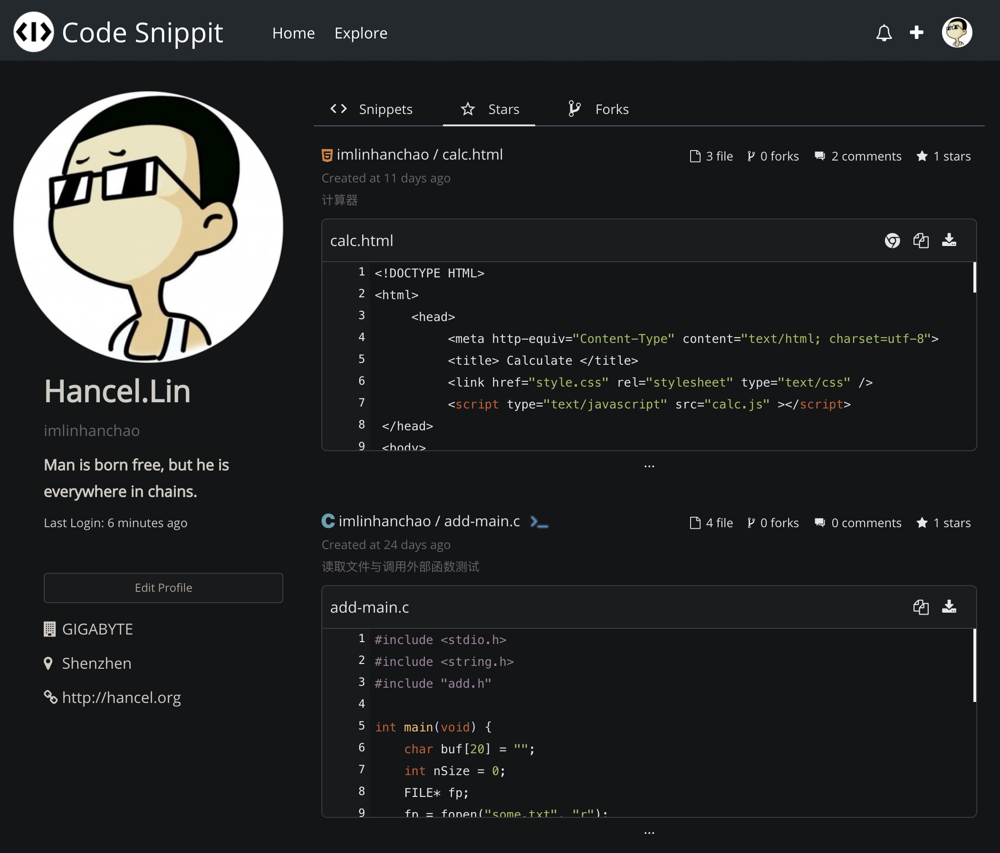

<p align="center">
  <a href="https://code-snippet.cn">
    
  </a>
</p>

<h1 align="center">Code Snippet</h1>
<p align="center">Snippet 代码分享网站。类似 Gist，但加入了多文件在线编译运行，Web 代码在线预览的功能。</p>

## ✨ 功能
- 😎分享发布代码片段。
- 💻支持十多种语言在线编译运行。
- ⭐可 Star / Fork 别人分享的代码。
- 💬评论代码片段，与作者交流。
- 🙈Follow 关注感兴趣的发布者（开发中...）。

## 📦 配置
1. 新建数据库`db`(根据需要，第二步配置时填入)；
2. 执行`npm run init`，并根据提示填写信息（仅第一次）；
3. 若需要重新配置数据库，则运行`npm run initdb`，**此步骤会清楚表数据！**
4. 若需要重置某个表，如：重置`account`表，则执行`npm run initdb -- account`。

## ⚙️ 调试
1. 执行`npm install`;
2. 前端执行`npm run dev`，后端使用 Visual Studio Code 运行调试（直接按下`F5`即可）。

## 🛡 部署
服务器需安装 `nodejs` 和 `npm` 。部署执行如下脚本：
```bash
npm install
```

编译前端代码：  
```bash
npm run build
```

启动服务：
```bash
npm start
```

以守护进程方式，启动服务：
```bash
forever start ./bin/www --uid snippet
```
or
```bash
pm2 start -n snippet npm -- start
```

## 📁 目录
- .vscode - VSCode 调试配置
- frontend - 前端代码  
    - assets - 前端资源  
    - components - 前端组件
    - store - vuex
    - theme - 全局样式
    - views - 界面 vue 文件
- bin - 服务启动入口  
- interface - 业务接口实现   
- lib - 公共类库  
- pubilc - 静态资源  
- routes - 服务路由  
- script - 脚本 

## 👀 界面


